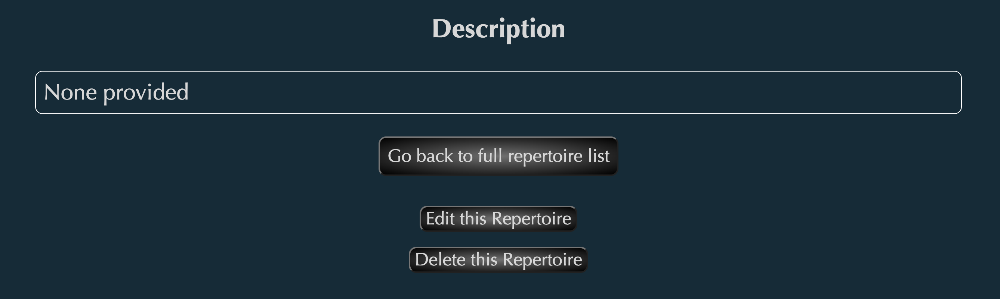

# Greater Las Vegas Music Services (GLVMS)- a Full-Stack Application

# How to navigate this website

Please click the link below to be redirected to the site.
[Greater Las Vegas Music Services (GLVMS)](https://glv-music-services-9d9878ce0c35.herokuapp.com/)

## List of technologies used
- HTML
- CSS
- Javascript
- EJS
- MongoDB / Mongoose
- Node.js
- Express

## Installation instructions
- None required

## User stories
- As a music client, I want to use this website to be able to quickly browse through the repertoire I need performed by the performer at my event, and also quickly know if the performer is available to travel to the even location on the date/time that I proposed. It will save a lot of time on my end not to send an email or a text to the performer directly, not knowing whether they are available, or if they can play the repertoire I need.
- As a potential employer, I want to view this candidate's project and analyze their proficiency in making fully functioning full-stack application, so that I can make a clear decision whether he is fit for our company or not.

## What to expect from this website

### The home page

On the home (main) page of this website, a simple welcome message and two main buttons will be shown as above, as well as a "hamburger" menu which the user will have access to on any given page, as shown below.

Upon clicking the "About GLVMS" button or the "About" menu on the navigation bar, the user will be taken to a page with more detailed information on what GLVMS is about.

On the bottom of the about page, a carousel of photos of the site administrator/main pianist of GLVMS is shown.

Click the "See Repertoire List" on the footer navigation bar or from the main page to explore the list of the available repertoire.

Scroll down the list to explore the available repertoire. Much more content will be added as the website continues to improve and will be connected to the full database of thousands of available repertoire. Each repertoire has an "add to cart" button, which can be clicked if the user desires to add this specific opus to the request. 

The user may choose to filter this page either by composer's name or the instrumentation. The composer filter will search for all opuses with that specifed composer; the instrumentation filter will search for all opuses that INCLUDE the selected instrument. Both filters can be used concurrently, if the user so desires.

Some repertoire will have movements (smaller parts of the larger opus). For each of these opuses, a "show movements" button will be available.

Upon clicking the above button, the individual movements of that specific opus will be shown, each with its own "add to cart" button that will allow the user to add those specific movements only, if he/she so desires.

Clicking on the title of the main opus will lead the user to the details page of that specific opus. Please keep in mind: for repertoire with movements, the main price that is shown is the bulk/discounted price for when a user selects to request the entire opus; the price to the right side is the price for each specific movement.

On the bottom of this details page, there will be a few buttons available. For the user, clicking the "Go back to full repertoire list" button will allow the user to go back to the main list to choose more repertoire as desired. For the admin, clicking the "Edit this repertoire" button will allow the admin to edit the details of this repertoire, and the "Delete this Repertoire" button will simply erase this specific opus from the main list.

Clicking on the "Edit this Repertoire" button will lead the admin to the edit page of that specific opus.

On this page, the admin can edit the details of the selected repertoire (title, composer, instrumentation, movements, price, and description). The already existing movements will be listed on the bottom, each with its own "delete" button in case the admin wants to remove specific movements or adjust the pricing of each movement.

If more movements must be added, the admin can click on the "Add Movements" button. An unlimited number of movements can be added. 

Once done editing, the admin may click the "Submit Revised Information" button to finalize the changes. The admin will then be redirected back to the newly edited details page of that specific opus.

The admin may also choose to add a new available repertoire. This page can be access through the "Add Repertoire" button at the bottom-right section of the about page. Upon clicking this button, the admin will be taken to the "Opus-newform" page:

Much like the opus-edit page, the admin may input the same kind of details to create a new opus. Once the admin clicks the "Add Repertoire" button on the bottom to finalize the addition, the website will redirect to the details page of the newly created repertoire.

The new repertoire will also be visible on the very bottom of the main list of repertoire page.

Going back to the main list of all available repertoire: every time the user selects an opus, the user is taken to the "view cart" page, containing all repertoire the user has requested so far in this session. The user may either select the "Clear Cart and Start Over" button to be redirected to the home page, or click the "Done Adding Repertoire" to be redirected to the "Add Request" page.

Please keep in mind: once the user chooses to finalize the repertoire request and go to the main request page, the selected repertoire list cannot be modified.

The user will input the details of the desired event here, including information of the user (name and instrument), and the event itself (title, date, time, address, city, state, zip, and comments, if any). Once complete, the user will be redirected to the details page of the newly created request. 

On the bottom of this page, the user can choose to edit or delete this specific request. If the user chooses to click the "See all requests" button instead, the site will redirect to the main list of requests page, where all requests made by the user will be shown with some details, which includes the reference number and a timestamp of when the request was first made and last edited. If the request list has been cleared or is empty, a simple message to reflect that fact will show instead.

All requests made by the user will be visible on this request list, and the admin may review it any time.

## Unsolved problems and major hurdles
- Constantly finding unresolved or new problems regarding routes: e.g. String, Array, or Object data not being passed correctly to/from back-end, resulting in extra lines of code especially in the controller just to modify it so that the back-end can correctly process the data and the front-end can correctly display the data
- When loading opus-edit or client-request-edit page, data within drop-down menu or date input box does not auto-populate like text input boxes

## Next steps for this project
- Further separate user and admin access by password protecting 
- Enable the website to accept multiple users and multiple admins and save different data for each account
- Connect to a larger (already available) personal database of thousands of repertoire to this website so that it accurately reflects all of the repertoire actually currently available to music clients
- Enable user to manipulate repertoire list at any given moment before the request is submitted (requires more work regarding correct data being sent/saved to the back-end)
- Continue exploring and fine-tuning with much more with CSS to make pages look cleaner, more modern, and more user-friendly

